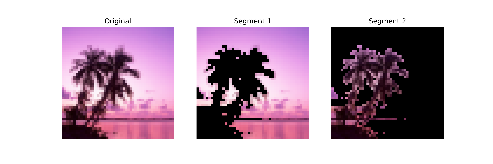

# Image Segmentation

This project implements an image segmentation algorithm using graph-based methods. By treating an image as a graph where pixels are nodes and edges represent spatial and brightness similarities, the segmentation process identifies distinct regions in the image. The algorithm leverages adjacency and degree matrices to compute a normalized graph Laplacian, whose second-smallest eigenvector provides the basis for segmentation. This approach is flexible, supporting both grayscale and color images, and effectively partitions an image into meaningful segments based on brightness and spatial proximity.

### Usage

```python
from image_segmenter import ImageSegmenter
segmenter = ImageSegmenter(filename="image_files/dream.png")
segmenter.segment()
```



